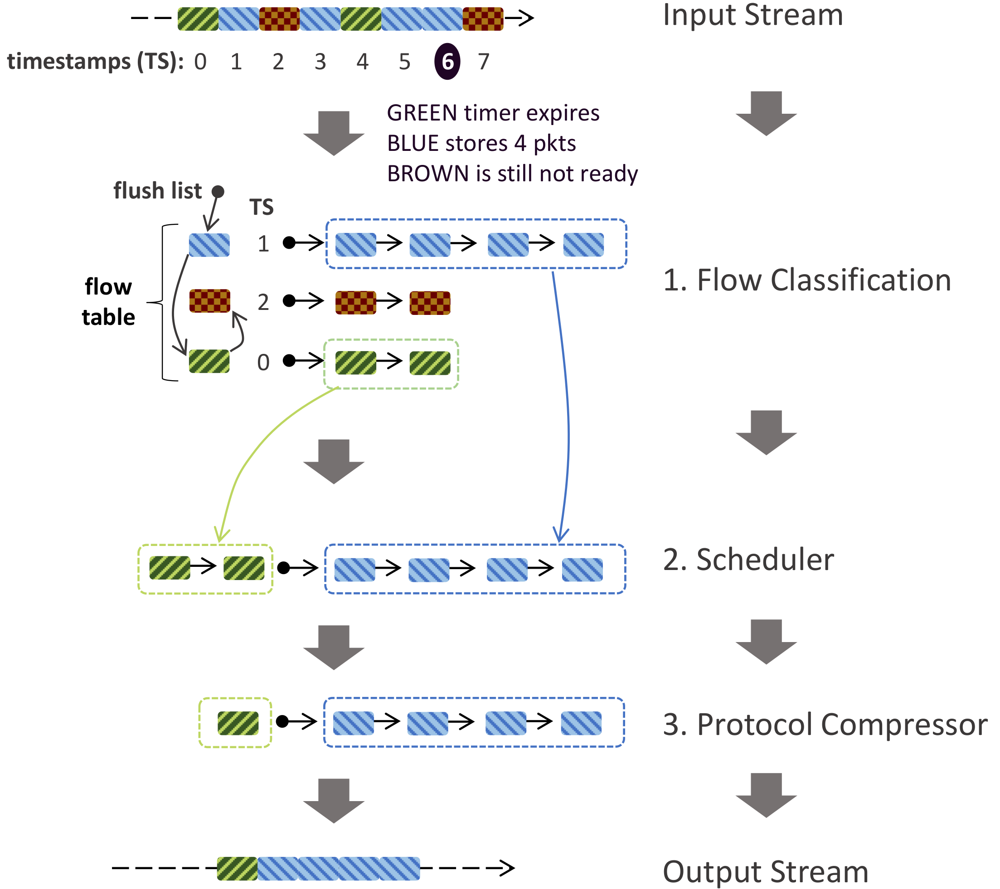

# Reframer
Reframer is a [FastClick](https://github.com/tbarbette/fastclick) based Network Function (NF) that leverages the idea of briefly buffering, delaying, and reordering the (possibly paced) incoming packets to increase spatial locality for network traffic. In a nutshell, Reframer consists of 3 components: *(i)* a **classifier** that arranges input packets to a flow table, *(ii)* a **scheduler** that flushes flows from the table after a given buffering time or upon achieving a given burst-size, and *(iii)* a **compressor** that coalesces packets to eliminate redundancy.

<p align="center">

</p>

Reframer is developed on [FastClick](https://github.com/tbarbette/fastclick), but it could be adapted to other packet processing frameworks!

For more information check out our paper at NSDI '22.

## Download

```
git clone --recursive https://github.com/hamidgh09/Reframer.git
```

## Repository Organization

## Build & Run

## Citing our paper
If you use Reframer, please cite our paper:

## Help
If you have any question regarding the code or the paper you can contact me (hamidgr [at] k t h [dot] s e).
