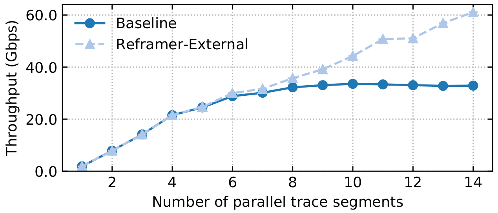
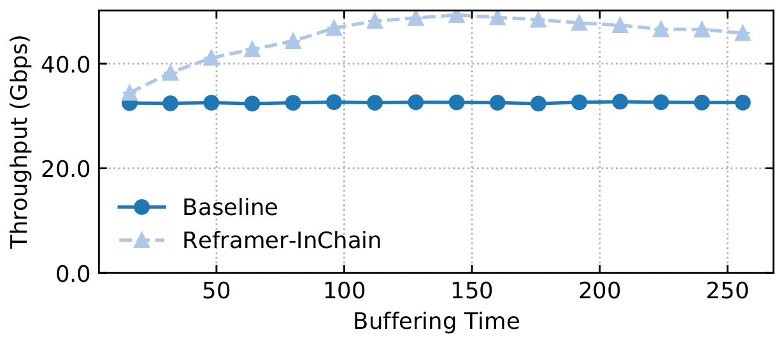
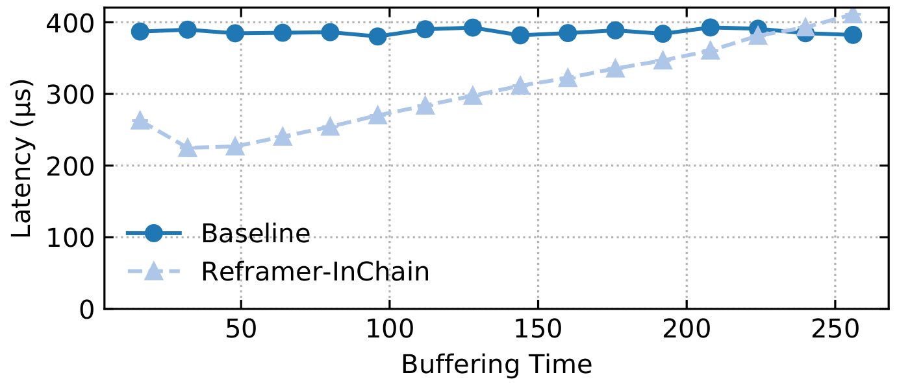

# Reframer Experiments
This directory contains configuration files and information about deploying Reframer in the network and evaluating the impact of Reframer on a chain of network functions.

To run these experiments you need 3 servers connected back-to-back. The first and last server act as traffic generator and DUT (Device Under Test) respectively, and we deploy an instance of Reframer on the middle server when we want to analyze the impact of an stand alone Refrmer on the DUT performance. 

**Note that you need to setup your testbed before running any experiment.**

## Trace file
All the experiments in our [paper][om] have been performed using a captured trace from the KTH campus. Unfortunately, we would not be able to make the campus trace available to the public due to GDPR. However, we provide the following experiments that use synthetic traces to validate the reusability and effectiveness of Reframer. You can use `make checkout_trace` to download trace files before running the experiments.

## Custom trace file
In current experiments, we use `IPSummaryDump` files to replay our trace files!
In case you want to run the experiment with your own `.pcap` trace file, you need to add `--variables GEN_DUMP=0` at the NPF commands and also, modify `GEN_MULTI_TRACE` to the proper value for your trace files. Read the generator module [configuration file][generator] for more information on this!

## Reframer on a dedicated server
In this experiment Reframer works on a dedicated server (the middle one), to show the maximum throughput and latency benefit that it can bring for the DUT! To do this experiment you can run `make test_external`. The output of this experiment, should be multiple figures, similar to the following:

shows the effectiveness of Reframer in improving the performance of the NF chain for different workloads (load is expressed as the number of parallel trace segments).

## Reframer on the same server with the NFs chain

In the following experiments, we evaluate deploying Reframer on the same server where an application is running.
We divide this part in two different experiments. The first experiment measures the maximum throughput of the DUT with and without deploying Reframer at the start of the chain. You can use `make test_in_chain_max_rate` to run this measurement. The output of this experiment should be a figure, similar to the following:

In the second experiment we measure the impact of Reframer on the latency of packets. To do so, we decrease the replaying rate to the maximum rate supported by DUT when Reframer does not exist in the chain; hence, it will be a fare comparison. To do the experiment you can run `make test_in_chain_latency`. The output latency of this experiment should be similar to the following figure:

[om]: https://www.usenix.org/conference/nsdi22/presentation/ghasemirahni
[generator]: https://github.com/tbarbette/npf/blob/master/modules/fastclick-play-single-mt.npf
